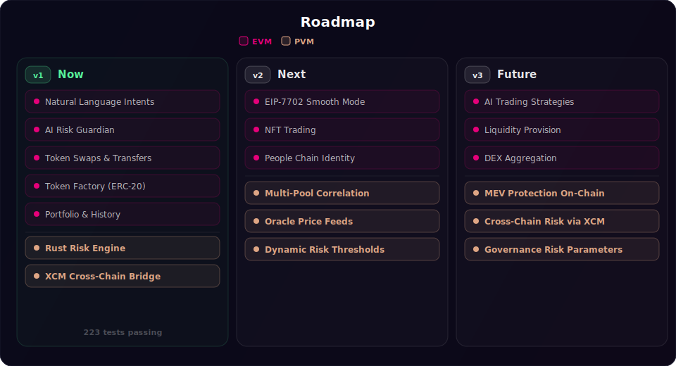

# IntentDOT

> AI-powered DeFi Intent Solver for Polkadot Hub

**Say what you want. Get it done safely.**

<p align="center">
  
</p>

IntentDOT lets you execute DeFi operations on Polkadot by simply typing what you want in natural language. An AI agent parses your intent, evaluates risks, and executes the optimal transaction — all in one interface.

## Features

- **Natural Language DeFi** — Type "Swap 10 DOT to USDT" instead of navigating complex DEX UIs
- **On-Chain Risk Engine (Rust/PolkaVM)** — Every swap validated by a Rust smart contract running natively on Polkadot. RED risk = transaction reverted automatically. [Details below](#on-chain-risk-engine)
- **AI Risk Guardian** — Off-chain pre-check: scores slippage, liquidity, and pool drain before you confirm
- **Token Transfers** — "Send 50 USDT to 0x..." — direct token transfers via intent
- **Token Factory** — "Create a token called PEPE with 1M supply" — deploy ERC20s from chat
- **On-Chain Whitelist** — Only verified tokens can be swapped/transferred (security layer)
- **Quote Expiry Timer** — 30s countdown on previews, auto-refresh with live pool data
- **One-Click Execution** — Preview exact amounts + risk, confirm, done
- **On-Chain Transaction History** — All swaps and transfers pulled directly from blockchain events (no backend)
- **Live Portfolio & Pool Data** — Token balances and pool prices/reserves in header, auto-refreshing
- **Quick Actions** — One-click chips for common intents (swap, bridge, balance, create token)
- **XCM Cross-Chain Teleport** — "Bridge 20 PAS to relay chain" — teleport native PAS to Paseo Relay Chain via XCM precompile. Uses burn/mint between trusted system chains (Hub ↔ Relay)
- **Polkadot Hub Native** — Solidity + Rust contracts on Polkadot Hub EVM & PolkaVM

## Architecture

```
User: "Swap 10 DOT to USDT"
         │
         ▼
    ┌─────────┐     ┌──────────────┐     ┌─────────────┐
    │ Chat UI │────→│  AI Parser   │────→│Risk Guardian│ ← off-chain (AI)
    └─────────┘     └──────────────┘     └──────┬──────┘
                                                │ user confirms
                                         ┌──────▼──────┐
                                         │   Intent    │
                                         │  Executor   │ (Solidity)
                                         └──────┬──────┘
                                                │
                                         ┌──────▼──────┐
                                         │ Risk Engine │ ← on-chain (Rust/PolkaVM)
                                         │  evaluate() │   RED → revert
                                         └──────┬──────┘
                                                │ GREEN/YELLOW
                                         ┌──────▼──────┐
                                         │  MockDEX    │ → swap executed
                                         └─────────────┘
```


## Quick Start

### Prerequisites

- Node.js 20+
- Foundry nightly (`curl -L https://foundry.paradigm.xyz | bash && foundryup --install nightly`)
- MetaMask browser extension

### 1. Install & Configure

```bash
git clone https://github.com/PavelMal/IntentDOT.git
cd IntentDOT

# Install frontend
cd frontend
npm install

# Configure environment
cp ../.env.example .env.local
# Edit .env.local — set your AI key (one of):
#   ANTHROPIC_API_KEY=sk-ant-...
#   OPENAI_API_KEY=sk-...
```

### 2. Add MetaMask Network

Add Polkadot Hub TestNet to MetaMask manually:

| Setting | Value |
|---------|-------|
| RPC URL | `https://eth-rpc-testnet.polkadot.io/` |
| Chain ID | `420420417` |
| Symbol | `PAS` |
| Explorer | `https://blockscout-testnet.polkadot.io` |

Get testnet tokens: [faucet.polkadot.io](https://faucet.polkadot.io/) → Polkadot testnet (Paseo) → Hub (smart contracts)

### 3. Run

```bash
# Start dev server (from frontend/)
npm run dev
# Open http://localhost:3000
```

The app connects to already deployed contracts on Polkadot Hub TestNet — no local deployment needed.

### 4. Run Tests

```bash
# Contract tests (46 tests)
cd contracts
forge install
forge test -vvv

# Frontend tests (185 tests)
cd frontend
npm test
```

### Deploy Your Own Contracts (optional)

```bash
cd contracts
forge script script/Deploy.s.sol \
  --rpc-url https://eth-rpc-testnet.polkadot.io/ \
  --private-key $DEPLOYER_PRIVATE_KEY \
  --broadcast --legacy

# Then update frontend/.env.local with new contract addresses
```

## Tech Stack

| Layer | Technology |
|-------|-----------|
| Frontend | Next.js 14, Tailwind CSS, wagmi v2, [w3wallets](https://github.com/Maksandre/w3wallets) + Playwright (E2E) |
| AI | Anthropic Claude / OpenAI GPT-4o (structured output) |
| Contracts | Solidity 0.8.24, Foundry (nightly), OpenZeppelin 5.x |
| PVM | Rust `no_std` + polkavm 0.26.0 → PolkaVM RISC-V bytecode |
| Network | Polkadot Hub TestNet (chain 420420417) |

## On-Chain Risk Engine

### Why on-chain validation?

Off-chain risk checks (like our AI Risk Guardian) can be bypassed — a user can call the contract directly, skip the frontend, or a bot can submit swaps with no UI at all. The only way to **guarantee** every swap is safe is to enforce risk limits **inside the smart contract itself**.

That's what the Risk Engine does. It's a Rust smart contract compiled to [PolkaVM](https://wiki.polkadot.network/docs/learn-polkavm) (Polkadot's native RISC-V virtual machine) and called by `IntentExecutor` before every swap. If risk is RED, the transaction reverts — no tokens move, no matter who submitted it.

### How it works

```
IntentExecutor.executeSwap()
  │
  ├─ 1. Read pool reserves from MockDEX
  ├─ 2. Call RiskEngine.evaluate(amountIn, reserveIn, reserveOut, tokenIn, tokenOut)
  │       │
  │       ├─ Calculate price impact (how much the trade moves the price)
  │       ├─ Compare current price to 20-trade moving average (MA20)
  │       ├─ Measure historical volatility (standard deviation)
  │       ├─ Composite score = 40% impact + 30% MA20 deviation + 30% volatility
  │       │
  │       └─ Return: riskLevel (GREEN/YELLOW/RED), score, priceImpact, volatility
  │
  ├─ 3. If RED → revert("risk too high") — swap blocked
  ├─ 4. If GREEN/YELLOW → proceed with swap
  └─ 5. Emit RiskChecked event (parsed by frontend for risk badge)
```

### Two-layer protection

| Layer | Where | Purpose | Enforcement |
|-------|-------|---------|-------------|
| **AI Risk Guardian** | Frontend (off-chain) | Pre-swap preview: scores slippage, liquidity, pool drain | UI blocks RED swaps (Confirm disabled), but can be bypassed by calling the contract directly |
| **Rust Risk Engine** | PolkaVM (on-chain) | Per-swap validation: price impact, MA20, volatility | Contract-level — transaction reverts on RED, cannot be bypassed by anyone |

### Per-pool tracking

Each pool (e.g. DOT/USDT, DOT/USDC) has its own price history stored in contract storage — a ring buffer of 20 recent prices. Pools can't contaminate each other's data. The pool identity is derived deterministically from sorted token addresses.

### Tech

- **Language:** Rust (`no_std`, `no_main`) — compiled to RISC-V via `polkavm 0.26.0`
- **Size:** ~6 KB `.polkavm` blob deployed on Polkadot Hub TestNet
- **Interface:** Standard Solidity ABI — `evaluate()` and `getStats()` callable from any EVM contract
- **Storage:** Per-pool ring buffer (20 slots), index, trade count — all keyed by pool ID

## OpenZeppelin Integration

IntentDOT uses [OpenZeppelin Contracts 5.x](https://docs.openzeppelin.com/contracts/5.x/) not as a boilerplate token deploy, but as **composable security primitives layered into a multi-contract DeFi system** with custom application logic on top.

### Contract Architecture & Customizations

**IntentExecutor** — `Ownable` + `ReentrancyGuard` + `Pausable` + `SafeERC20` + `IERC20Permit` + custom modifiers

The core contract composes five OZ modules with domain-specific logic that doesn't exist in any workshop template:

- `ReentrancyGuard` (`nonReentrant`) protects the multi-step approve→swap flow where the contract pulls tokens from the user, approves the DEX, executes the swap, and returns output tokens — four external calls in one transaction
- `Pausable` (`whenNotPaused`) acts as an emergency circuit breaker across both `executeSwap()` and `executeTransfer()`. This is critical because the contract interacts with a **cross-VM Rust Risk Engine** (PolkaVM) — if the PVM contract misbehaves, the owner can halt all operations instantly
- `SafeERC20` (`safeTransfer`, `safeTransferFrom`, `forceApprove`) wraps all token interactions to handle non-standard ERC20 implementations that don't return bool — a real production security concern
- `IERC20Permit` enables **gasless approvals** via EIP-2612: `executeSwapWithPermit()` calls `permit()` then swaps in a single transaction — no separate approve tx needed. Perfect for AI intent UX: user signs once, swap executes
- `Ownable` secures admin functions (`setRiskEngine`, `setFactory`, `pause`/`unpause`) while the custom `onlyWhitelisted` modifier enforces a token allowlist that neither OZ nor any standard provides — only pre-approved tokens can flow through the system
- Custom `whitelistToken()` has a **dual-authority pattern**: both `owner()` (from OZ Ownable) and `factory` address can whitelist tokens, enabling automated token onboarding from TokenFactory while keeping manual control for the admin

```
IntentExecutor is Ownable, ReentrancyGuard, Pausable
│   using SafeERC20 for IERC20
│
├── executeSwap()            [nonReentrant, whenNotPaused, onlyWhitelisted×2]
│   └── _doSwap()            → risk check → safeTransferFrom → forceApprove → DEX swap → safeTransfer
│
├── executeSwapWithPermit()  [nonReentrant, whenNotPaused, onlyWhitelisted×2]
│   ├── permit()             → EIP-2612 gasless approval (off-chain signature)
│   └── _doSwap()            → same swap logic, no prior approve needed
│
├── executeTransfer()        [nonReentrant, whenNotPaused, onlyWhitelisted]
├── pause()/unpause()        [onlyOwner] — emergency stop
├── setRiskEngine()          [onlyOwner] — plug/unplug PVM risk oracle
├── setFactory()             [onlyOwner] — authorize TokenFactory
└── whitelistToken()         [owner OR factory] — dual-authority pattern
```

**TokenFactory** — `AccessControl` with `CREATOR_ROLE`

Goes beyond simple Ownable by using role-based permissions:

- `CREATOR_ROLE` — required to deploy new tokens. Separates "who can create tokens" from "who administers the factory"
- `DEFAULT_ADMIN_ROLE` — can grant/revoke `CREATOR_ROLE` to other addresses
- The factory deploys `MockERC20` (OZ ERC20), calls `mint()` on the new token (allowed because factory is the deployer/owner), then auto-whitelists via IntentExecutor's dual-authority `whitelistToken()`
- This creates a **cross-contract permission chain**: AccessControl (factory) → Ownable (new token) → dual-auth whitelist (executor)

**MockERC20** — `ERC20` + `ERC20Burnable` + `ERC20Permit` + `Ownable`

Tokens are OZ ERC20 with restricted minting (`onlyOwner`), burn support, and **EIP-2612 permit** for gasless approvals. The `Ownable` constraint on `mint()` is what makes the TokenFactory pattern secure — only the deployer (factory) can mint the initial supply, preventing inflation attacks. `ERC20Permit` enables the `executeSwapWithPermit()` flow — users sign a typed-data message off-chain (free, no gas), and the executor contract handles approval + swap in one transaction.

### Library Dependencies

```
@openzeppelin/contracts v5.1.0
├── access/Ownable.sol                       → IntentExecutor, MockERC20
├── access/AccessControl.sol                 → TokenFactory
├── utils/ReentrancyGuard.sol                → IntentExecutor
├── utils/Pausable.sol                       → IntentExecutor
├── token/ERC20/ERC20.sol                    → MockERC20
├── token/ERC20/extensions/ERC20Burnable.sol → MockERC20
├── token/ERC20/extensions/ERC20Permit.sol   → MockERC20 (EIP-2612 gasless approvals)
├── token/ERC20/extensions/IERC20Permit.sol  → IntentExecutor (permit interface)
├── token/ERC20/IERC20.sol                   → IntentExecutor, MockDEX
└── token/ERC20/utils/SafeERC20.sol          → IntentExecutor, MockDEX
```

### What's custom (not from OZ)

- **Token whitelist** with dual-authority (owner + factory) — no OZ equivalent
- **Cross-VM risk check** — IntentExecutor calls a Rust/PolkaVM contract before every swap
- **AMM routing** — IntentExecutor reads pool reserves, routes through MockDEX
- **Intent parsing** — AI frontend parses natural language into contract calls

### Test Coverage

46 Foundry tests verify the full integration, including 9 OZ-specific tests:

| Test | Verifies |
|------|----------|
| `test_pause_blocks_swap` | `Pausable` — swap reverts with `EnforcedPause()` when paused |
| `test_pause_blocks_transfer` | `Pausable` — transfer reverts when paused |
| `test_unpause_resumes_swap` | `Pausable` — operations resume after `unpause()` |
| `test_non_owner_cannot_pause` | `Ownable` — reverts with `OwnableUnauthorizedAccount` |
| `test_createToken_reverts_no_role` | `AccessControl` — reverts with `AccessControlUnauthorizedAccount` |
| `test_swapWithPermit_happy_path` | `ERC20Permit` — full permit→swap in one tx, no prior approve |
| `test_swapWithPermit_expired_deadline` | `ERC20Permit` — expired deadline reverts |
| `test_swapWithPermit_wrong_signer` | `ERC20Permit` — invalid signature reverts |
| `test_swapWithPermit_replay_reverts` | `ERC20Permit` — nonce consumed, replay blocked |

## Smart Contracts

| Contract | Description |
|----------|-------------|
| **IntentExecutor** | Entry point: executeSwap, executeSwapWithPermit, executeTransfer, token whitelist, risk check. OZ Ownable + ReentrancyGuard + Pausable + SafeERC20 + ERC20Permit |
| **RiskEngine** | Rust/PolkaVM: on-chain risk scoring (price impact, MA20, volatility) |
| **MockDEX** | Uniswap V2 AMM: addLiquidity, swap, getAmountOut |
| **MockERC20** | OZ ERC20 + ERC20Burnable + ERC20Permit + Ownable — mintable by owner, gasless approvals (testnet only) |
| **TokenFactory** | Deploy new ERC20 tokens, auto-whitelist. OZ AccessControl (CREATOR_ROLE) |

## Deployed Contracts (Polkadot Hub TestNet)

| Contract | Address |
|----------|---------|
| DOT Token | `0x0Fb72340AA780c00823E0a80429327af63E8d2Fc` |
| USDT Token | `0x12e41FDB22Bc661719B4D7445952e1b51C429dDB` |
| USDC Token | `0x540De5E6237395b63cFd9C383C47F5F32FAb3123` |
| MockDEX | `0x5b2810428f3DA3400f111f516560EE63d44c336A` |
| IntentExecutor V3 | `0xdD44bd254dD0bBB6Bfe7C7C062aDA4150e1546d7` |
| TokenFactory | `0x1Ba4FDBab1C786Bd0aE8c4105711b90dDf87FCDD` |
| RiskEngine (PVM Rust) | `0x20c0dF8e93A0c400b7b36f699101972712ad7f9F` |

**Network:** Polkadot Hub TestNet (Paseo)
- Chain ID: `420420417`
- RPC: `https://eth-rpc-testnet.polkadot.io/`
- Symbol: `PAS`
- Explorer: [Blockscout TestNet](https://blockscout-testnet.polkadot.io)
- Faucet: [faucet.polkadot.io](https://faucet.polkadot.io/) → Polkadot testnet (Paseo) → Hub (smart contracts)

**Seeded Pools:**
- DOT/USDT — 50,000 DOT / 337,500 USDT (1 DOT = 6.75 USDT)
- DOT/USDC — 50,000 DOT / 337,500 USDC

## Roadmap

<p align="center">
  
</p>

## Hackathon

Built for **Polkadot Solidity Hackathon 2026** (EVM Smart Contracts + PVM Smart Contracts tracks).

## Tests

- **Contracts:** 46 Foundry tests — swap (9), permit (4), whitelist (5), transfer (4), pausable (4), factory (8), risk engine (11), events
- **Frontend:** 185 Jest tests — intent validation (47), risk scoring (22), preview builder (25), risk display (28), XCM encoder (15), bridge flow (12), integration (12), E2E testnet (24)
- **Total:** 231 tests (46 contract + 185 frontend/E2E)
- Run: `cd contracts && forge test -vvv` / `cd frontend && npm test`

## License

MIT
